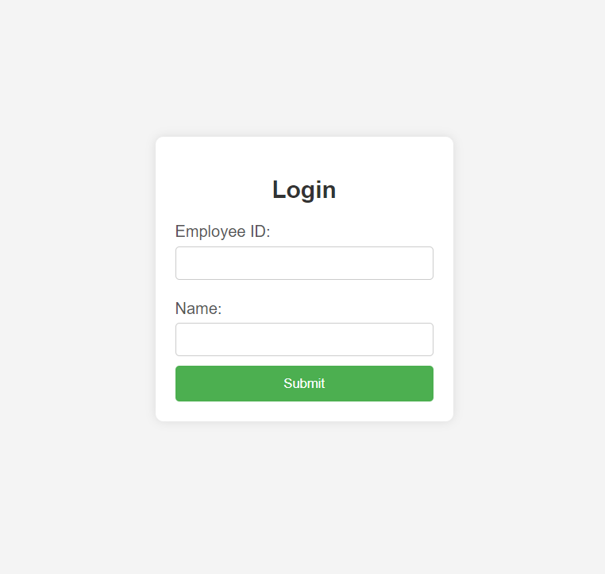
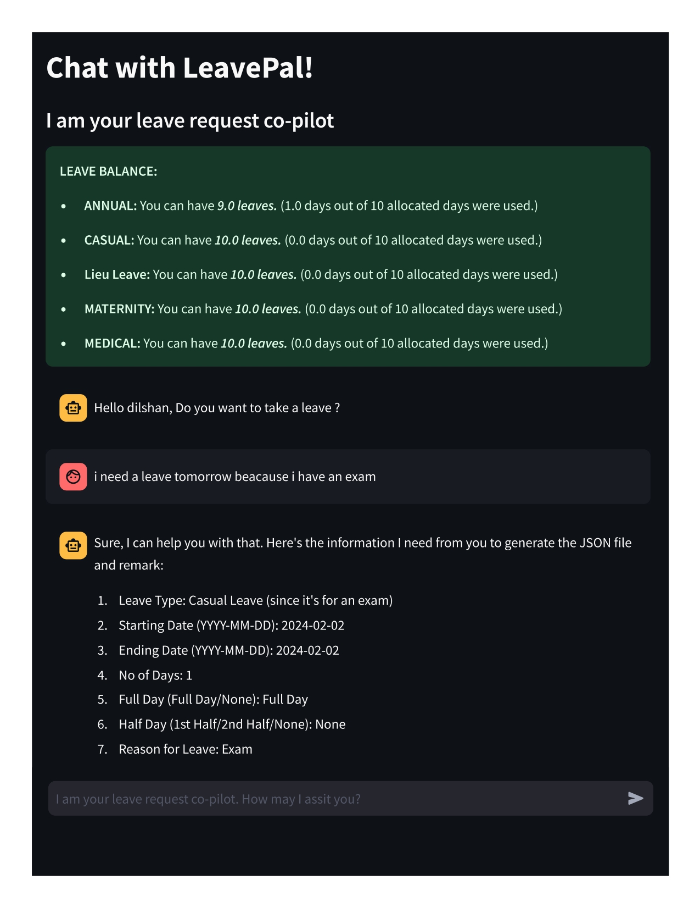
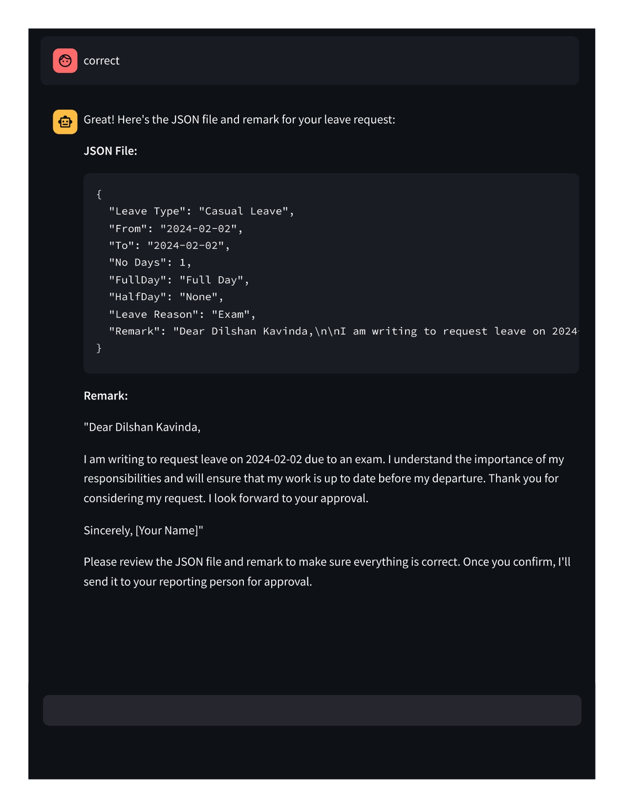

<h1>Streamlit Copilot Project</h1>

  <h2>Overview</h2>

  
The Streamlit Copilot project is a friendly leave request co-pilot that interacts with users to collect information about their leave requests. It generates a JSON file and a corresponding remark using Google's generative AI model (Gemini-Pro). This repository includes both the Streamlit application and a Flask backend for retrieving user details.

  <h2>Files</h2>
    <ol>
        <li>Main Python file containing the Streamlit application code.
            <ul>
                <li>Imports necessary libraries such as Streamlit, os, Google's generative AI (genai), pandas, requests, and dotenv.</li>
                <li>Configures Streamlit settings and initializes the Gemini-Pro model.</li>
                <li>Defines an API endpoint to retrieve user details from the Flask Copilot.</li>
            </ul>
        </li>
        <li>Flask backend for handling user details.
            <ul>
                <li>Exposes endpoints to capture and retrieve user details.</li>
            </ul>
        </li>
    </ol>
    <h2>Configuration</h2>
    
Before running the Streamlit Copilot, set the following environment variables in a <code>.env</code> file:

    <pre>
        GOOGLE_API_KEY=your_google_api_key
        reporting_person=your_reporting_person
    </pre>
    <h2>Installation</h2>
    <ol>
        <li>Clone the repository:</li>
        <pre>
            git clone https://github.com/your-username/your-repository.git
            cd your-repository
        </pre>
        <li>Install the required Python libraries:</li>
        <pre>
            pip install -r requirements.txt
        </pre>
        <li>Run the Flask Copilot (ensure it's running before starting the Streamlit Copilot):</li>
        <pre>
            python app.py
        </pre>
        <li>Run the Streamlit Copilot:</li>
        <pre>
            streamlit run copilot.py
        </pre>
    </ol>
    
Make sure to replace <code>your-username</code> and <code>your-repository</code> with your actual GitHub username and repository name. This assumes that the <code>requirements.txt</code> file includes the necessary dependencies for your project.

    <h2>Usage</h2>
    <ol>
        <li>Open your web browser and navigate to the application.</li>
        <li>Enter the required information for the leave request as prompted by the co-pilot.</li>
        <li>The co-pilot will generate a JSON file and a corresponding remark based on the provided details.</li>
        <li>View the generated insights and remarks on the Streamlit interface.</li>
    </ol>
    <h2>Important Notes</h2>
    <ul>
        <li>Ensure you have a valid Google API key set in the environment variable <code>GOOGLE_API_KEY</code>.</li>
        <li>The Flask Copilot should be running to retrieve user details. Refer to the Flask Copilot's README for instructions.</li>
    </ul>
    <h2>Contributing</h2>
    
Contributions are welcome! Feel free to fork the project, open issues, and submit pull requests. Contributions could include bug fixes, feature enhancements, documentation improvements, or any valuable suggestions.

  <h2>License</h2>
  
This project is licensed under the <a href="LICENSE">MIT License.</a>

   
Feel free to customize and extend the functionality of the copilot according to your needs. For any issues or questions, please refer to the documentation or contact me.

   
